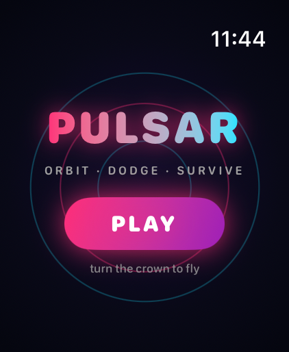
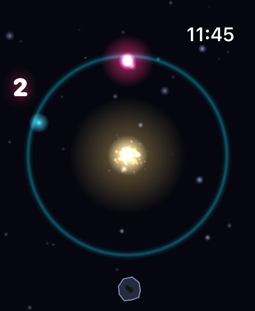

# PULSAR ⌚️

A neon space arcade game for Apple Watch, designed around the Digital Crown
and built to shine on the Apple Watch Ultra.

 

## The game

You pilot a glowing comet locked in orbit around a dying star.
**Turn the Digital Crown** to sweep around the orbit ring.

- ☄️ **Dodge asteroids** that hurtle across your orbit — one hit ends the run
- 💠 **Catch energy orbs** for points; each one raises your combo multiplier
  (up to ×9), but let one expire and the combo resets
- 🛡 **Grab shield rings** to survive one hit
- ⏱ Survive: +1 point/second, +2 for every asteroid dodged, and the
  spawn rate and speed climb the longer you live
- 🏆 Best score is saved on-device

Full juice: particle comet trail, additive-blend glow everywhere, explosion
bursts, screen shake, white-flash death, twinkling parallax starfield, star
corona, and haptics for every event.

## Tech

- Standalone watchOS app (no iPhone companion) — SwiftUI shell + SpriteKit scene
- Zero bitmap assets: every texture (glow dots, neon rings, asteroids) is
  generated with CoreGraphics at launch; the app icon is drawn by
  `Tools/make_icon.swift`
- No physics engine — hand-rolled deterministic movement and distance-based
  collisions, cheap enough for a steady frame rate on the watch
- Crown input uses a continuous 0–360° binding; the scene eases toward it
  along the shortest arc so the wrap never causes a spin-around

## Build

```sh
brew install xcodegen   # one time
xcodegen generate
open Pulsar.xcodeproj   # run the "Pulsar Watch App" scheme
```

Launch with the `PULSAR_AUTOSTART` argument to skip the menu (used for
simulator automation/screenshots).
