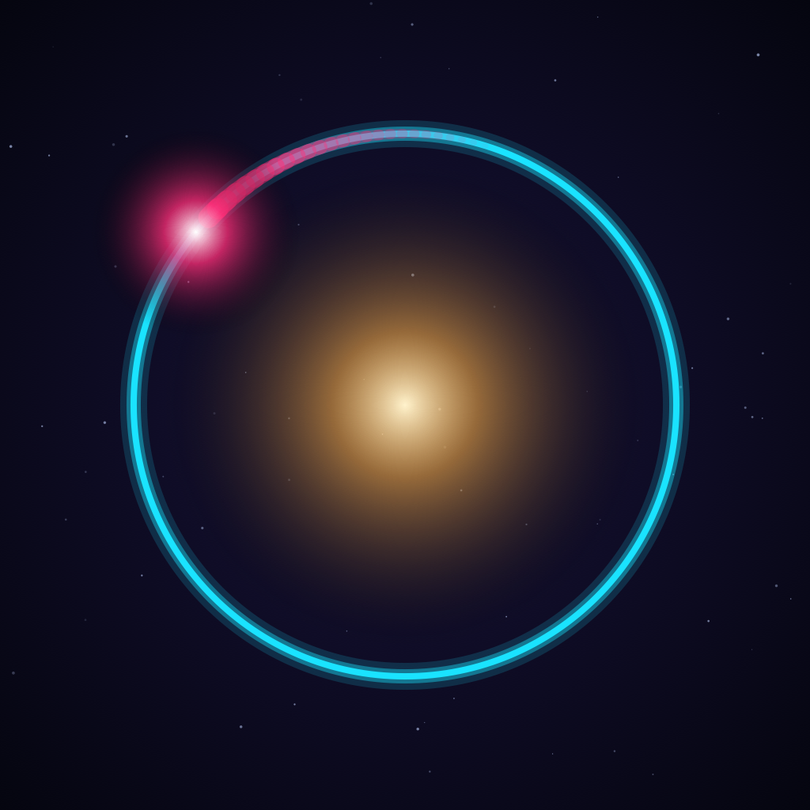
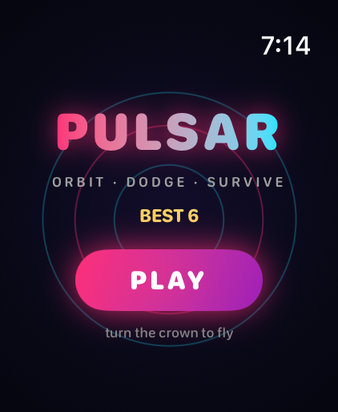
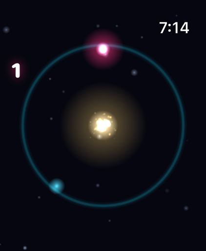
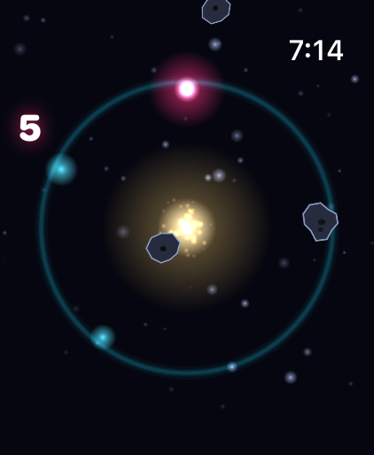
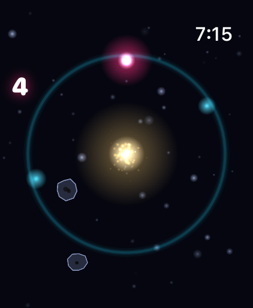
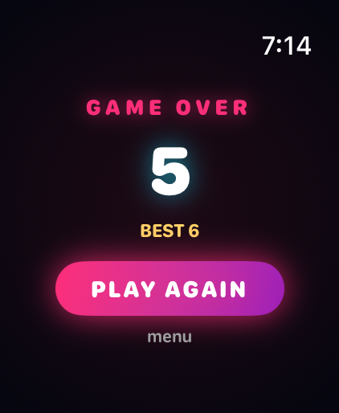
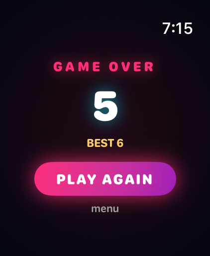

<p align="center">
  
</p>

<h1 align="center">P U L S A R</h1>

<p align="center">
  <strong>A neon arcade game for Apple Watch</strong><br/>
  <em>Orbit a dying star. Dodge asteroids. Survive.</em>
</p>

<p align="center">
  
  
  
  
</p>

---

<p align="center">
  
  &nbsp;&nbsp;
  
  &nbsp;&nbsp;
  
</p>

<p align="center">
  
  &nbsp;&nbsp;
  
  &nbsp;&nbsp;
  
</p>

<p align="center"><sub>Running on Apple Watch Ultra 3 (49mm) simulator</sub></p>

---

## The Game

You pilot a glowing comet locked in orbit around a pulsing golden star.
**Turn the Digital Crown** to sweep around the ring — that's your only control.

| Element | What it does |
|---|---|
| **Asteroids** | Tumble across the orbit from all directions — one hit kills you |
| **Energy orbs** | Cyan pickups on the ring — grab them for points and a combo multiplier (up to **x9**) |
| **Shield rings** | Rare cyan ring pickup — absorbs one asteroid hit |
| **Combo decay** | Let an energy orb expire without collecting it and your combo resets to x1 |
| **Survival bonus** | +1 point/sec just for staying alive, +2 for every asteroid dodged |

Difficulty ramps forever: asteroids spawn faster, fly harder, and surge every ~18 seconds. How long can you survive?

## Visual Design

Every pixel is drawn to feel premium on the Apple Watch Ultra's big OLED display:

- **Additive-blend glow** on the comet, star, pickups, and orbit ring
- **Particle comet trail** that paints the ring as you fly
- **Star corona** with animated sparks radiating outward
- **Parallax starfield** — two depth layers of twinkling stars
- **Explosion bursts** with screen shake and white flash on death
- **Floating score pops** (+10, +30, +90) at pickup locations
- **Haptics** for every event — collect, shield, hit, death, UI tap

## Zero Bitmap Assets

The entire game ships without a single image file in the bundle. Every texture — soft glow dots, neon rings, jagged crater-pocked asteroids — is **procedurally generated with CoreGraphics** at launch. Even the app icon is drawn by a Swift script (`Tools/make_icon.swift`). This keeps everything pixel-crisp at any watch resolution.

## Architecture

```
PulsarWatch/
├── PulsarApp.swift          # @main entry point
├── GameState.swift          # ObservableObject shared between SwiftUI and SpriteKit
├── Palette.swift            # Neon color system (SwiftUI + CoreGraphics)
├── Game/
│   ├── GameScene.swift      # SpriteKit scene — the full gameplay loop
│   ├── Textures.swift       # Procedural CoreGraphics texture generation
│   └── Haptics.swift        # WatchKit haptic feedback wrapper
└── Views/
    ├── ContentView.swift    # Phase router (menu → game → game over)
    ├── MenuView.swift       # Animated title screen with breathing rings
    ├── GameView.swift       # SpriteKit host + Digital Crown binding + HUD
    └── GameOverView.swift   # Score reveal with spring animation
```

- **SwiftUI** handles navigation, HUD overlay, and Digital Crown input
- **SpriteKit** runs the real-time game loop with hand-rolled movement — no physics engine, so motion stays deterministic and cheap
- **GameState** is the bridge: SwiftUI owns it, the scene mutates it from the render loop

## Build & Run

```bash
# Prerequisites
brew install xcodegen       # one time

# Generate & open
cd Pulsar
xcodegen generate
open Pulsar.xcodeproj
```

Select the **Pulsar Watch App** scheme, pick any Apple Watch simulator (or your real watch), and hit Run.

> **Tip:** Launch with the `PULSAR_AUTOSTART` argument to skip the menu — useful for screenshots and debugging.

## Requirements

| | Minimum |
|---|---|
| **watchOS** | 10.0 |
| **Xcode** | 16.0 |
| **Swift** | 5.0 |

Standalone watch app — no iPhone companion required.

---

<p align="center">
  Made with SpriteKit, SwiftUI, and late nights<br/>
  <strong>at0m-b0mb</strong>
</p>
